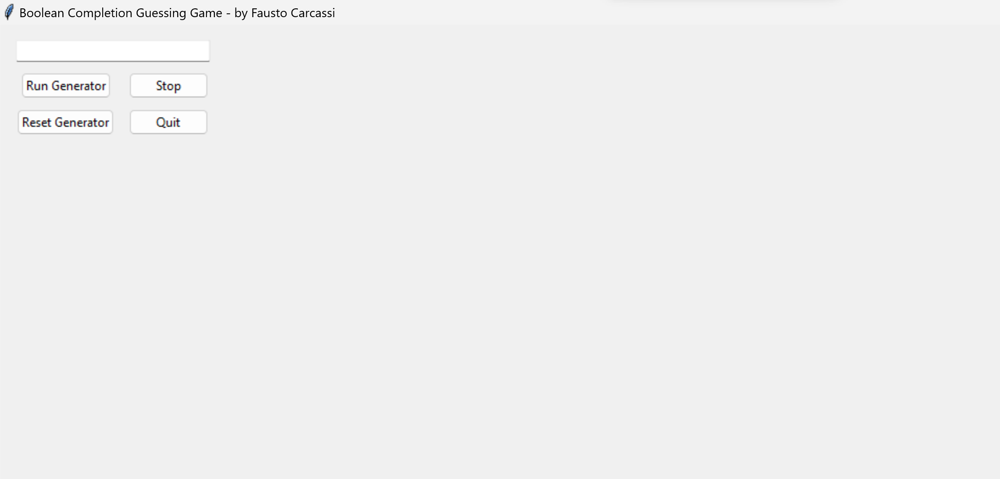

# An illustration of Program Induction

This repo contains executables for a little interactive illustration of program induction. You can input a binary string that is missing the last character, and run the program to find guesses for the full string, answering the question "What's the missing character?".

The grammar has primitives "0", "1", "C_" (for concatenation of two strings), "R_" (for repetition; takes a string and an integer), and integers from 2 to 6.

This is the starting screen:

Write something in the text box and press the Run button, and you should see a counter for the inference steps thus far, as well as a list of ranked hypotheses:

The interface is very simple indeed, but should be enough for a first demonstration of program induction!

Suggested pedagogical pipeline:
1. Explain simple grammar
2. Ask students to produce a string & its encoding
3. See if the system can come up with the encoding

Some suggested strings to input:
- 0
- 0000
- 001
- 010
- 0011001
- 0010001

NOTE: To make it extra fun, use a misleading emphasis when reading the string, e.g., "zero ZERO one zero zero ZERO one".
